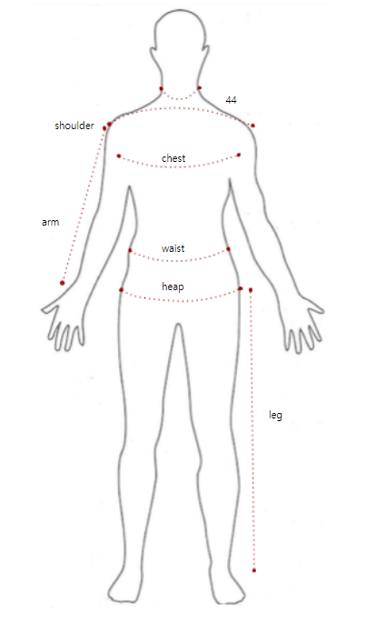

# img view
this is custom elements for visualization additional information over images.

<hr>

## img_marker
img marker is elements making easy to put text over images



#### import
``` html
<script type = 'module'>
import imgMarker from './imgmarker.js'
customElements.define("img-marker", imgMarker)
</script>
```

#### usage
``` html

</img-marker>

<script>
window.onload = function(e){
  img-marker.setValue('marker1', 'value1' )
}
</script>
```

#### attribute
src : source image file
marker : define markers
  `
  marker-name1 : x-position, y-postion;
  marker-name2 : x-position, y-postion;
  :
`

#### method
setValue(key,value) : set value of marker by key
setValues(json) : insert keys and values using json for multiple assignment
