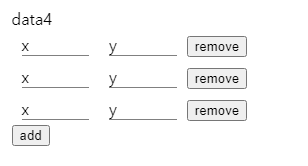

# jsinput
this is custom elements for create simple input interfaces using json


#### import
``` html
<script type = 'module'>
import jsInput from './jsinput.js'
customElements.define("js-input", jsInput)
</script>
```

#### usage
``` html
<js-input
  id = 'ji'
  input = '{
    "data1":"text/width:100px",
    "data12":"text/width:100px",
    "data13":"text/width:100px",

    "data2":"select/options:1,2,3,4/width:40",
    "data3":"/width:170px",
    "data4": [{
      "x":"/width:50px",
      "y":"/width:50px"
      }]
  }'
>
</js-input>
```

### input definition

#### single input
> "[inputname]":"[type]/[css]"

- inputname : key of json values
- type : type of input
  - none : (example : "data:/width:30px") create short text input
  - text : create line text input
  - ... (to be upgraded)

#### list input
> "[inputname]":[  ]

list of inputs with add, remove button



#### method
- extractJson : get json object from input values
