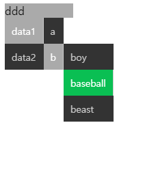

# popupSel
popup menu supporting tree structure

<hr>



#### import
``` html
<script type = 'module'>
import popupSel from './popupsel.js'
customElements.define('popup-sel', popupSel)
</script>
```

### usage
``` html
<popup-sel id = tpop >
select
</popup-sel>

<script type = 'module'>
import popupSel from './popupsel.js'
customElements.define('popup-sel', popupSel)
const menus = {
  'data1':{
    'a':['admin','adams'],
    'b':['boy','baseball','beast']
  },
  'data2':['x','y','z']
}
tpop.setList(jdata)
</script>

```


#### attribute
- value : selected
- labels : text convert table

#### event handler
- onselect : select event
